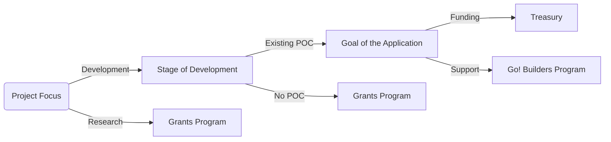

#  Go! Grants Program<!-- omit in toc -->

  

- [:wave: Introduction](#wave-introduction)
  - [Guidelines](#guidelines)
- [:level\_slider: Levels](#level_slider-levels)
- [Grant Distribution](#Grant-Distribution)

  
## :wave: Introduction

At Health Hero, we're on a mission to build the future of fun, digital health engagement, and Web3-AI. We believe that by working together with the developer community, we can create experiences that will empower millions of people to take control of their health and well-being. Our platform is built on the latest in web3 technology and is designed to be flexible, extensible, and scalable. We offer a wide range of features and integrations that are designed to meet the needs of developers, healthcare providers, and patients alike. One of the key features of our platform is our API, which allows developers to access a wide range of health activity data. This data can be used to build integrations and applications that will help people stay healthy and engaged.For more information about the Go! Plateform, please visit the [about-the-go-platform](https://www.goplatform.io/#about-the-go-platform) on our website.

### Guidelines

Anyone is welcome to apply for a grant. Projects funded through our programs are broad in scope.

Generally, your project will have better chances to be accepted if:

- It presents a **well-researched** or tested concept, for which ideally you are able to show some prior work.
- You can demonstrate that the project will be **maintained** after completion of the grant, be it through an obvious commitment to the technology from your side, additional funding sources or an existing business model.
- Your team has **proven experience** with the relevant languages and technologies and/or a strong technical background. You will be asked to provide the GitHub profiles of your team members as part of your application, which we will examine for past activity and code quality. Naturally, you can also link to projects on other platforms.
- Your application is **rich in technical details** and well-defined.
- You can clearly present how your project stands out among competitors or implements technology that doesn't exist in the ecosystem yet.

Additionally, it must fulfill the following requirements:

- All code produced as part of a grant must be **open-sourced**, and it must also not rely on closed-source software for full functionality. We prefer Apache 2.0, but GPLv3, MIT or Unlicense are also acceptable.
- Furthermore, the focus of the application should lie on the software that is being implemented/research being carried out as part of the grant, and less on your project/venture/operation. For the purpose of the application and delivery, think about how others might also benefit from your work.
- As a general rule, teams are asked to finish a grant before applying for another one.
- Lastly, we do not fund projects that actively encourage gambling, illicit trade, money laundering or criminal activities in general.

Retention 40%+ on day 1 and 17%+ on day 7  
Users 1K+ (for a 7-day campaign)  
Average playtime 3 minutes+  
The cost to acquire a user <$1  
The average revenue per user >$1

Finally, we take licensing and the right of all teams in and outside the ecosystem to be recognised for their work very seriously. Using others' work with no attribution or indication that this was not your own work as part of a milestone delivery **will lead to immediate termination**. Please reach out to us before submitting if you have any doubts on how to comply with a specific license and we'll be happy to help.

Retention 40%+ on day 1 and 17%+ on day 7  
 Users 1K+ (for a 7-day campaign)  
Average playtime 3 minutes+  
The cost to acquire a user <$1  
The average revenue per user >$1

We also try to enforce our [code of conduct](CODE_OF_CONDUCT.md) and based on this may [block users](https://github.blog/2016-04-04-organizations-can-now-block-abusive-users/).

## :level_slider: Levels

Our grant program is designed to provide funding and resources to promising projects and teams in the web3 health game & engagement ecosystem. We're looking for innovative ideas and talented individuals who are working to push the boundaries of what's possible on the decentralized web.

### :hatching_chick: Level 1 (= **Sidekick**)<!-- omit in toc -->

- **Target:** Individuals & small teams
- **Amount:** Up to $10,000 worth of $HLTHY
- **Requirements:** 2 approvals
- **Benefits:** Feedback during application process and evaluation, introduction to related teams/projects

### :baby_chick: Level 2<!-- omit in toc -->

- **Target:** Small teams/start-ups
- **Amount:** Up to $30,000 worth of $HLTHY
- **Requirements:** 3 approvals
- **Benefits:** All of the above + co-promotion, Grants Program badge, fast track to Go! Builders Program.

### :rooster: Level 3<!-- omit in toc -->

- **Target:** Companies/foundations with a proven track record
- **Amount:** Unlimited $HLTHY
- **Requirements:** 5 approvals (for >$100k: Go! Foundation Council approval + Pitch call)
- **Benefits:** All of the above + VC introductions

## Grant-Distribution<!-- omit in toc -->

- 20%: 50 MAU & 1 unique health attribute  
- 20%: 100 MAU & 2 more health attributes  
- 60%: 1000 MAU & 2 more health attributes

### Go! Builders Program

The following flowchart gives a rough, oversimplified view of how the Grants Program and Go! Builders Program.

## :information_source: License<!-- omit in toc -->

[Apache License 2.0](LICENSE) © Go! Plateform
